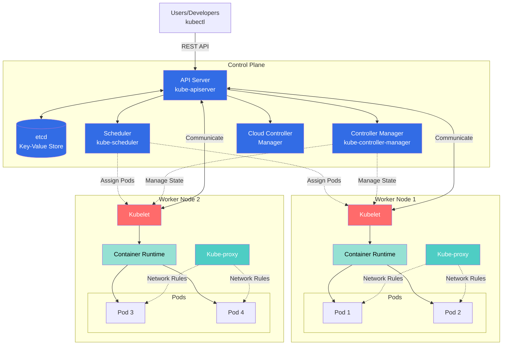

# Kubernetes Summary

## Overview

Kubernetes (K8s) is an open-source container orchestration platform that automates deployment, scaling, and management of containerized applications. It was originally designed by Google and is now maintained by the Cloud Native Computing Foundation (CNCF).

## Kubernetes Architecture Diagram



**Legend:**
- **Blue (Control Plane)**: Manages the cluster state and makes global decisions
- **Red (Kubelet)**: Node agent that manages pods on each worker node
- **Teal (Kube-proxy)**: Network proxy maintaining network rules
- **Light Green (Container Runtime)**: Runs the containers (Docker, containerd, etc.)
- **Solid lines**: Direct communication
- **Dashed lines**: Management/control flow

## Architecture

### Control Plane Components

**API Server (kube-apiserver)**: The front-end for the Kubernetes control plane. It exposes the Kubernetes API and is the entry point for all administrative tasks.

**etcd**: A consistent and highly-available key-value store used as Kubernetes' backing store for all cluster data.

**Scheduler (kube-scheduler)**: Watches for newly created Pods with no assigned node and selects a node for them to run on based on resource requirements, constraints, and available resources.

**Controller Manager (kube-controller-manager)**: Runs controller processes that regulate the state of the cluster. Examples include Node Controller, Replication Controller, Endpoints Controller, and Service Account Controller.

**Cloud Controller Manager**: Integrates with underlying cloud provider APIs to manage cloud-specific resources like load balancers and storage volumes.

### Node Components

**Kubelet**: An agent that runs on each node in the cluster. It ensures containers are running in a Pod and communicates with the control plane.

**Kube-proxy**: A network proxy that maintains network rules on nodes, enabling communication to Pods from inside or outside the cluster.

**Container Runtime**: Software responsible for running containers (e.g., Docker, containerd, CRI-O).

### Key Concepts

**Pod**: The smallest deployable unit in Kubernetes. A Pod encapsulates one or more containers, storage resources, a unique network IP, and options for how containers should run.

**Service**: An abstract way to expose an application running on a set of Pods as a network service. Provides stable IP addresses and DNS names.

**Namespace**: Virtual clusters within a physical cluster, providing scope for resource names and enabling resource isolation.

**ReplicaSet**: Ensures a specified number of Pod replicas are running at any given time.

**Deployment**: Provides declarative updates for Pods and ReplicaSets, managing rollouts and rollbacks.

**ConfigMap**: Stores non-confidential configuration data in key-value pairs that can be consumed by Pods.

**Secret**: Similar to ConfigMap but designed to hold sensitive information like passwords, tokens, or keys.

## Essential kubectl Commands

### Cluster Information
```bash
# Display cluster information
kubectl cluster-info

# View cluster nodes
kubectl get nodes

# Get detailed node information
kubectl describe node <node-name>
```

### Working with Pods
```bash
# List all pods in current namespace
kubectl get pods

# List pods in all namespaces
kubectl get pods --all-namespaces

# Get detailed pod information
kubectl describe pod <pod-name>

# View pod logs
kubectl logs <pod-name>

# Follow pod logs in real-time
kubectl logs -f <pod-name>

# Execute command in a pod
kubectl exec -it <pod-name> -- /bin/bash

# Delete a pod
kubectl delete pod <pod-name>
```

### Deployments
```bash
# Create a deployment
kubectl create deployment <name> --image=<image>

# List deployments
kubectl get deployments

# Update deployment image
kubectl set image deployment/<name> <container>=<new-image>

# Scale deployment
kubectl scale deployment/<name> --replicas=3

# View rollout status
kubectl rollout status deployment/<name>

# Rollback deployment
kubectl rollout undo deployment/<name>

# Delete deployment
kubectl delete deployment <name>
```

### Services
```bash
# List services
kubectl get services

# Expose deployment as service
kubectl expose deployment <name> --port=80 --type=LoadBalancer

# Delete service
kubectl delete service <name>
```

### ConfigMaps and Secrets
```bash
# Create ConfigMap from literal values
kubectl create configmap <name> --from-literal=key=value

# Create Secret
kubectl create secret generic <name> --from-literal=password=mypass

# List ConfigMaps
kubectl get configmaps

# List Secrets
kubectl get secrets
```

### Namespaces
```bash
# List namespaces
kubectl get namespaces

# Create namespace
kubectl create namespace <name>

# Set default namespace
kubectl config set-context --current --namespace=<name>

# Delete namespace
kubectl delete namespace <name>
```

### Apply and Manage Resources
```bash
# Apply configuration from file
kubectl apply -f <filename.yaml>

# Apply all YAML files in directory
kubectl apply -f ./directory/

# Delete resources from file
kubectl delete -f <filename.yaml>

# Get all resources
kubectl get all

# View resource YAML
kubectl get <resource> <name> -o yaml
```

## Kubernetes Manifest Examples

### Pod Manifest
```yaml
apiVersion: v1
kind: Pod
metadata:
  name: nginx-pod
  labels:
    app: nginx
spec:
  containers:
  - name: nginx
    image: nginx:1.21
    ports:
    - containerPort: 80
    resources:
      requests:
        memory: "64Mi"
        cpu: "250m"
      limits:
        memory: "128Mi"
        cpu: "500m"
```

### Deployment Manifest
```yaml
apiVersion: apps/v1
kind: Deployment
metadata:
  name: nginx-deployment
  labels:
    app: nginx
spec:
  replicas: 3
  selector:
    matchLabels:
      app: nginx
  template:
    metadata:
      labels:
        app: nginx
    spec:
      containers:
      - name: nginx
        image: nginx:1.21
        ports:
        - containerPort: 80
        env:
        - name: ENVIRONMENT
          value: "production"
```

### Service Manifest
```yaml
apiVersion: v1
kind: Service
metadata:
  name: nginx-service
spec:
  type: LoadBalancer
  selector:
    app: nginx
  ports:
  - protocol: TCP
    port: 80
    targetPort: 80
```

### ConfigMap Manifest
```yaml
apiVersion: v1
kind: ConfigMap
metadata:
  name: app-config
data:
  database_url: "postgresql://db:5432/mydb"
  cache_enabled: "true"
  log_level: "info"
```

### Secret Manifest
```yaml
apiVersion: v1
kind: Secret
metadata:
  name: app-secret
type: Opaque
data:
  # Values must be base64 encoded
  username: YWRtaW4=
  password: cGFzc3dvcmQxMjM=
```

## Ingress in Kubernetes

### What is Ingress?

Ingress is an API object that manages external access to services within a cluster, typically HTTP and HTTPS. It provides load balancing, SSL termination, and name-based virtual hosting. Unlike Services (LoadBalancer or NodePort), Ingress allows you to consolidate routing rules in a single resource.

### Ingress Components

**Ingress Resource**: A Kubernetes resource that defines rules for routing external traffic to services.

**Ingress Controller**: A controller that fulfills the Ingress rules, usually with a load balancer. Popular options include NGINX Ingress Controller, Traefik, HAProxy, and cloud-provider specific controllers.

### Installing NGINX Ingress Controller
```bash
# Using Helm
helm repo add ingress-nginx https://kubernetes.github.io/ingress-nginx
helm install nginx-ingress ingress-nginx/ingress-nginx

# Or using kubectl
kubectl apply -f https://raw.githubusercontent.com/kubernetes/ingress-nginx/controller-v1.8.1/deploy/static/provider/cloud/deploy.yaml
```

### Basic Ingress Manifest
```yaml
apiVersion: networking.k8s.io/v1
kind: Ingress
metadata:
  name: basic-ingress
  annotations:
    nginx.ingress.kubernetes.io/rewrite-target: /
spec:
  ingressClassName: nginx
  rules:
  - host: example.com
    http:
      paths:
      - path: /
        pathType: Prefix
        backend:
          service:
            name: web-service
            port:
              number: 80
```

### Ingress with Multiple Paths
```yaml
apiVersion: networking.k8s.io/v1
kind: Ingress
metadata:
  name: multi-path-ingress
spec:
  ingressClassName: nginx
  rules:
  - host: myapp.com
    http:
      paths:
      - path: /api
        pathType: Prefix
        backend:
          service:
            name: api-service
            port:
              number: 8080
      - path: /web
        pathType: Prefix
        backend:
          service:
            name: web-service
            port:
              number: 80
```

### Ingress with TLS/SSL
```yaml
apiVersion: networking.k8s.io/v1
kind: Ingress
metadata:
  name: tls-ingress
spec:
  ingressClassName: nginx
  tls:
  - hosts:
    - secure.example.com
    secretName: tls-secret
  rules:
  - host: secure.example.com
    http:
      paths:
      - path: /
        pathType: Prefix
        backend:
          service:
            name: secure-service
            port:
              number: 443
```

### Creating TLS Secret
```bash
# Create TLS secret from certificate files
kubectl create secret tls tls-secret \
  --cert=path/to/tls.crt \
  --key=path/to/tls.key
```

### Ingress with Name-Based Virtual Hosting
```yaml
apiVersion: networking.k8s.io/v1
kind: Ingress
metadata:
  name: virtual-host-ingress
spec:
  ingressClassName: nginx
  rules:
  - host: app1.example.com
    http:
      paths:
      - path: /
        pathType: Prefix
        backend:
          service:
            name: app1-service
            port:
              number: 80
  - host: app2.example.com
    http:
      paths:
      - path: /
        pathType: Prefix
        backend:
          service:
            name: app2-service
            port:
              number: 80
```

### Common Ingress Annotations
```yaml
apiVersion: networking.k8s.io/v1
kind: Ingress
metadata:
  name: annotated-ingress
  annotations:
    # Redirect HTTP to HTTPS
    nginx.ingress.kubernetes.io/force-ssl-redirect: "true"
    
    # Enable CORS
    nginx.ingress.kubernetes.io/enable-cors: "true"
    
    # Rate limiting
    nginx.ingress.kubernetes.io/limit-rps: "10"
    
    # Custom timeout
    nginx.ingress.kubernetes.io/proxy-connect-timeout: "30"
    
    # Enable sticky sessions
    nginx.ingress.kubernetes.io/affinity: "cookie"
spec:
  ingressClassName: nginx
  rules:
  - host: api.example.com
    http:
      paths:
      - path: /
        pathType: Prefix
        backend:
          service:
            name: api-service
            port:
              number: 8080
```

### Checking Ingress Status
```bash
# List all ingresses
kubectl get ingress

# Get detailed ingress information
kubectl describe ingress <ingress-name>

# View ingress YAML
kubectl get ingress <ingress-name> -o yaml

# Check ingress controller logs
kubectl logs -n ingress-nginx -l app.kubernetes.io/name=ingress-nginx
```

## Best Practices

1. **Use Namespaces** to organize resources and implement resource quotas
2. **Define Resource Limits** for containers to prevent resource exhaustion
3. **Use ConfigMaps and Secrets** to separate configuration from application code
4. **Implement Health Checks** using liveness and readiness probes
5. **Use Labels and Selectors** consistently for resource organization
6. **Version Control Manifests** and use GitOps workflows
7. **Implement RBAC** for security and access control
8. **Use Helm Charts** for complex application deployments
9. **Monitor and Log** using tools like Prometheus and Grafana
10. **Regular Updates** to keep cluster components and applications current

---

This summary provides a foundation for working with Kubernetes. For production environments, consider exploring advanced topics like StatefulSets, DaemonSets, Persistent Volumes, Network Policies, and cluster security hardening.
